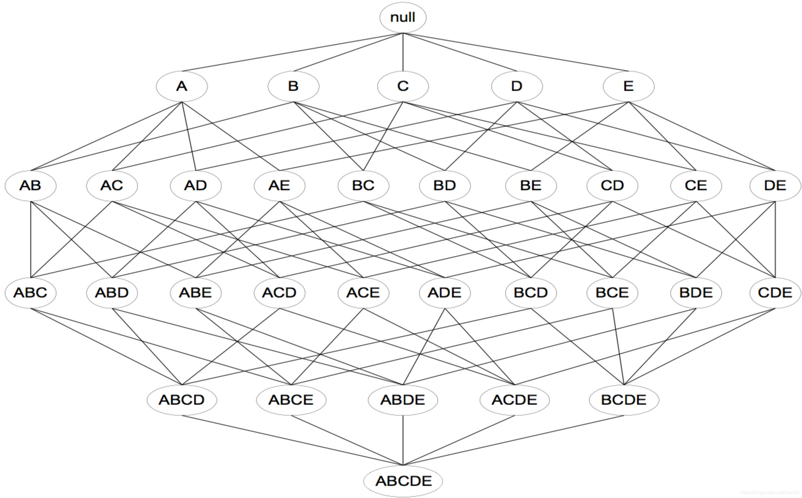
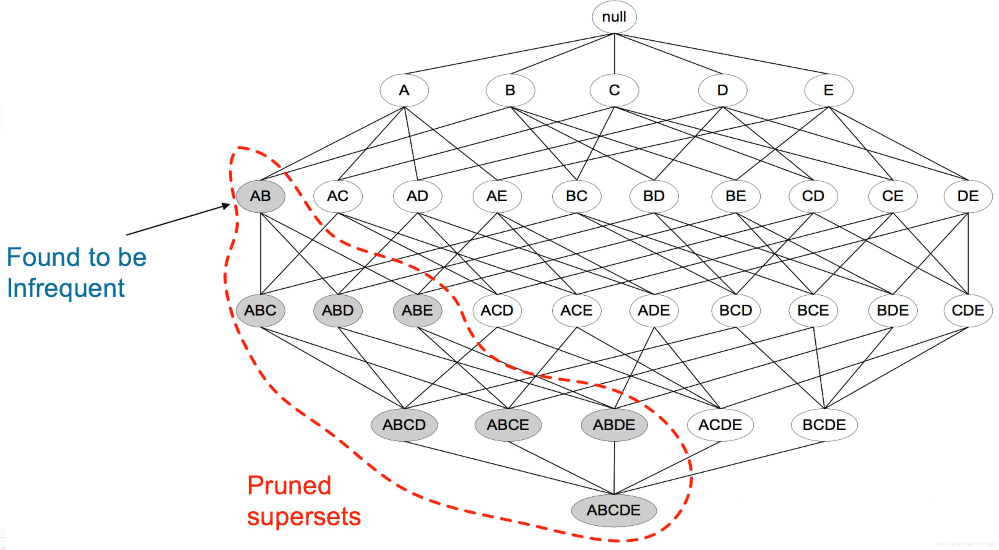
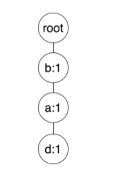
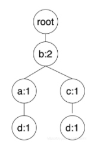
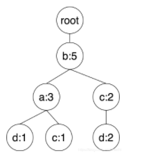
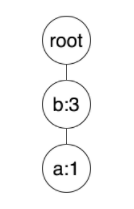
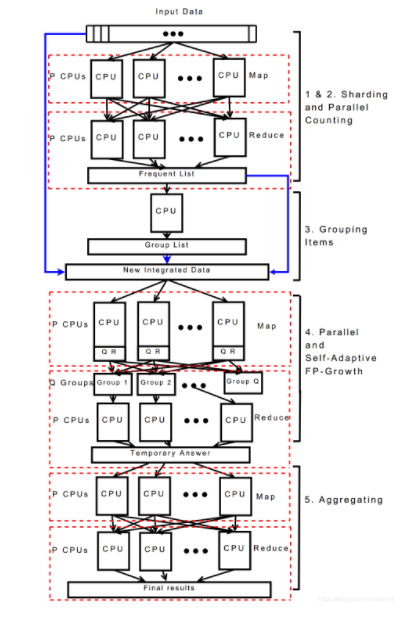

# 高级操作系统大作业赛题一

### 1.小组成员

SA20221053 李林枫

SA20221901 朱池苇

### 2.项目环境

spark-3.1.2-bin-hadoop3.2

openjdk 1.8.0_292

### 3.项目结构

​	本项目用scala语言编写，用maven组织。代码结构如下。
- 项目src/main/AR目录下存放源代码文件。
- main文件夹中存放频繁项集挖掘与关联规则生成与关联规则匹配与推荐分值计算这两个模块的代码。
- util包里FPTree、AssociationRules是频繁项集挖掘所必须的数据结构，FPNewDef是基于mllib的FP-Growth算法的优化版本。
- conf文件夹包含一个Conf类用于程序运行参数配置。

~~~shell
|____src
| |____main
| | |____resources
| | |____scala
| | | |____AR
| | | | |____Main.scala                 # main函数
| | | | |____main
| | | | | |____FPGrowth.scala           # 频繁项集挖掘与关联规则生成
| | | | | |____RecPartUserRdd.scala     # 关联规则匹配与推荐分值计算
| | | | |____conf
| | | | | |____Conf.scala                  # 配置参数类
| | | | |____util
| | | | | |____AssociationRules.scala     # 关联规则实体类 
| | | | | |____FPTree.scala          
| | | | | |____FPNewDef.scala             # PFP基于spark源码优化算法
~~~

### 4.实验说明

#### 4.1.并行化设计思路和方法 

##### 4.3.1 问题定义

​		关联规则是形如$X\rightarrow Y$的蕴含表达式，其中X和Y为不相交的项集，关联规则的强度可以用其支持度和置信度来度量，支持度确定规则可以用于给定数据集的频繁程度，而置信度确定Y在包含X的事务中出现的频繁程度。

​		关联规则发现问题可以形式地描述为：给定事务的集合T，关联规则发现是指找出支持度大于等于minisup并且置信度大于等于miniconf的所有规则，其中minisup和miniconf是对应的支持度和置信度阈值。关联规则挖掘算法通常采用的一种策略是将关联规则挖掘任务分解为如下两个主要的子任务：

​		（1）频繁项集产生：其目标是发现满足最小支持度阈值的所有项集，这些项集被称为频繁项集。

​		（2）规则的产生：其目标是从上一步发现的频繁项集中提取所有高置信度的规则。

​		规则产生可以简单描述为：将项集Y划分为两个非空的子集X和Y - X，得到规则$X\rightarrow Y-X$，该规则的置信度可以表示为$\sigma(X\cup \{Y-X\})/\sigma(X)=\sigma(Y)/\sigma(X)$，由于Y是频繁项集，故这样的规则必定已经满足支持度阈值，挑选出满足置信度阈值的规则即可。

​		通常，频繁项集产生所需的计算开销远大于产生规则所需的开销，因此下文的设计思路主要介绍频繁项集算法。


##### 4.3.2 FP-Growth算法

​		频繁项集产生最原始的方法为枚举求解，使用格结构枚举所有可能的项集（如下图所示），一个包含k个项的数据集可能产生$2^k-1$个频繁项集。将每个候选项集与每个事务进行比较，如果候选项集包含在事务中，则候选项集的支持度计数增加。这种方法的开销非常大，需进行O(NMw)次比较，其中N为事务数，M为候选项集数，w为事务的最大宽度。

​		

​		枚举求解效率低下，因此产生了Apriori算法，该算法利用了一个先验知识（Apriori就是先验的意思）：当一个购买组合不是频繁项时，包含其的任何超集也必然不是频繁项。因此可以基于这个原则对搜索空间进行剪枝。

​		

​		而FP-Growth算法则采用了完全不同的方法来发现频繁项集，该算法使用了一种成为FP树的紧凑型数据结构，并直接从该结构中提取频繁项集，该算法仅需扫描两次数据库，第一次统计每个商品的频次，用于剔除不满足最低支持度的商品，排序得到FreqItems，第二次，扫描数据库建立FP树。因此算法效率更高。

​		FP树是一种输入数据的压缩表示，它通过逐个读入事务，并把每个事务映射到FP树中的一条路径来构造，由于不同的事务可能会有若干个相同的项，因此它们的路径可能部分重叠。路径相互重叠越多，使用FP树结构获得的压缩效果越好，如果FP树足够小，能够存放在内存中，就可以直接从这个内存中的结构提取频繁项集，而不必重复地扫描存放在硬盘上的数据。给定FP树之后，用自底向上的方式探索这棵树并产生频繁项集。下面以一组购物数据为例，解释FP-Growth算法的过程。

| 事务 | 购买的商品 |
| :--: | :--------: |
|  1   |   a b d    |
|  2   |   b c d    |
|  3   |   a b e    |
|  4   |   a b c    |
|  5   |   b c d    |

​		假定最小支持度为0.4。首先获取购买商品的频次，可以看到商品按频次降序排列的结果为：{b：5, a：3, c：3, d：3}，由于e商品仅出现了一次，不符合最小支持度要求，因此去除。然后以根节点为起始状态开始构建FP树。

​		输入事务1，购买商品为abd，按照上面排序后的顺序bad添加节点，节点内容为“商品：频次”，后一个商品以前一个商品为父节点，每出现一次某一商品，节点频次加一。如下图所示：



​		输入事务2，购买商品为bcd，排序后同样为bcd，添加路径bcd，可以发现本条路径和上一步添加的路径第一个节点均为b，则可共用同一节点，节点b的频次加一（但仅有从起点开始连续的相同节点可以合并，如bcd和bad中虽然最后一个节点均为b，但不能合并)。如下图所示：



​		以此类推，可以生成最终的PF树，如图所示：



​		此后，根据这棵PF树来挖掘频繁项集，对每一频次符合最小支持度的商品，自底向上地寻找以其为前缀的频繁项集（包括本身）。从其节点开始，若其本身符合支持度要求，则本身为一频繁项集，并向上构建一个子树进行挖掘，子树构建方法为：新建一个新的FP树，遍历树中所有的a节点，往上找，直到root节点，然后把当前路径上的非根节点添加到subTree中，每个节点的频次为当前遍历节点的频次。

​		按照前文排序的顺序，首先寻找以b为前缀的频繁项集，b仅有一个节点为(b, 5)，显然符合支持度要求，则其本身是一个频繁项，而从b节点开始向上仅有根节点，则结束，以b为前缀的频繁项集为(b, 5)。

​		第二个商品为a，图中a节点仅有一个为(a, 3)，其本身为一频繁项集，向上寻找可以构建一棵由根节点和b节点构成的子树，注意此处b节点的频次需要改为a节点的频次3，而(b, 3)仍然满足频繁项集，则加上a前缀，可以得到(ab, 3)频繁项集。则以a为前缀的频繁项集为(a, 3)和(ab, 3)。

​		第三个商品为c，图中有两个c节点，则c的频次为1+2=3，(c, 3)是一个频繁项集，从两个c节点分别构建子树，(c, 1)节点向上可得到(a, 1), (b, 1)，(c, 2)向上可得到(b, 2)，这里由于两条路径同时通过b节点，因此b节点频次为3，构建得到的子树如下。显然(a, 1)不符合最小支持度要求，因此丢弃；而(b, 3)符合要求，可以得到频繁项集(cb, 3)，故以c为前缀的频繁项集为(c, 3)，(cb, 3)。



​		第四个商品同理可以得到其频繁项集为(d, 3)、(dc, 2)、(db, 3)和(dcb, 2)。


##### 4.3.3 PFP-Growth

​		PFP-Growth全称为Parallel FP-Growth，即并行FP-Growth算法，目前多数分布式开发库中的FP-Growth算法均基于这一算法实现，包括本实验采用的Spark。

​		当数据量较大时，单机的FP-Growth算法无法存储完整的FP树，且效率较慢。PFP-Growth算法即为将算法并行化后的结果，该算法使用三次Map-Reduce操作对FP-Growth进行了并行化：

​		（1）第一次map-reduce用于统计每个item的频次，得到frequentSets。

​		（2）第二次map-reduce实现分布式的FP-Growth，mapper负责生成group-dependent transactions。首先将frequentSets进行分组，不同机器负责不同商品频繁项的挖掘，不同商品有各自的group_id。此后对交易数据根据其商品的group_id进行划分，送往不同的reducer。而reducer各自执行普通FP-Growth算法。

​		（3）第三次map-reduce则合并上面得到的不同频繁项集，得到最终结果。

​		PFP-Growth算法的工作流如下图所示：




#### 4.2.详细的算法设计与实现 


#### 4.3.实验结果与分析

##### 4.3.1.正确性

##### 4.3.2.性能

#### 4.4.程序代码说明 

##### 4.4.1.编译方法

使用maven编译打包本项目。编译打包命令为：

```shell
mvn clean install
```

##### 4.4.2.运行命令

　　运行脚本如下所示，由于赛题中只给出了一个输入路径参数和一个输出路径参数，因此代码中读取输入路径为`input+'/D.dat'`和`input+'/U.dat'`，所以在输入路径文件夹中需要包含D.dat和U.dat文件。代码中输出路径为`output+'/Frep'`和`output+'/Rec'`。临时工作目录用于存储关联规则。

```shell
${SPARK_HOME/bin}/spark-submit \
--master <test spark cluster master uri> \
--class AR.Main \
--executor-memory 20G \
--driver-memory 20G \
<your jar file path> \
hdfs://<输入文件夹路径> \
hdfs://<结果输出文件(夹)路径> \
hdfs://<临时工作目录路径>
```

##### 4.4.3.代码逻辑

主函数对象：处理对应输入参数，然后通过FP_Growth算法计算频繁模式。

```scala
object Main {
  def main(args: Array[String]): Unit = {
    val start = System.currentTimeMillis()
    assert(
      args.length >= 2,
      "Usage: JavaFPGrowthExample <input-file> <output-file> <tmp-file> <spark.cores.max (optional)> <spark.executor.cores (optional)>"
    )
    val otherArgs = for (i <- 0 until args.length if i >= 2) yield args(i)
    val myConf = Conf.getConfWithoutInputAndOutput(otherArgs.toArray)
    println("args:" + myConf.toString())

    val conf = new SparkConf().setAppName(myConf.appName)
    myConf.inputFilePath = args(0)
    myConf.outputFilePath = args(1)
    myConf.tempFilePath = args(2)
    FP_Growth.total(myConf, conf)
    val end = System.currentTimeMillis()
    println("total time: " + (end - start) / 1000 + "s")
  }
}
```

FP_Growth对象：设置参数后，实例化实际的FPNewDef()。

```scala
object FP_Growth {

  def total(myConf: Conf, conf: SparkConf): Unit = {
    val partitionNum = myConf.numPartitionAB //336
    ...
    val sc = new SparkContext(conf)
    val data = sc.textFile(myConf.inputFilePath + "/D.dat", partitionNum)
    val transactions = data.map(s => s.trim.split(' ').map(f => f.toInt))
    val fp = new FPNewDef() //FPGrowth()
      .setMinSupport(0.092) // 0.092
      .setNumPartitions(partitionNum)
    val fpgrowth = fp.run(transactions)
    fpgrowth.freqItemsets.persist(StorageLevel.MEMORY_AND_DISK_SER)
    genFreSortBy(myConf.outputFilePath + "/Freq", fpgrowth)
    sc.stop()
  }
}
```

FPNewDef类：一种用于挖掘频繁项集的并行 FP-growth 算法。

```scala
class FPNewDef private (
    private var minSupport: Double,
    private var numPartitions: Int
) extends Serializable {  
    ...
    def run(data: RDD[Array[Int]]): FPModel = {
        val count = data.count()
        val minCount = math.ceil(minSupport * count).toLong
        val numParts =
          if (numPartitions > 0) numPartitions else data.partitions.length
        val partitioner = new HashPartitioner(numParts)
        val freqItems = genFreqItems(data, minCount, partitioner)
        val freqItemsets = genFreqItemsets(data, minCount, freqItems, partitioner)
        new FPModel(freqItemsets)
    }
}
```

